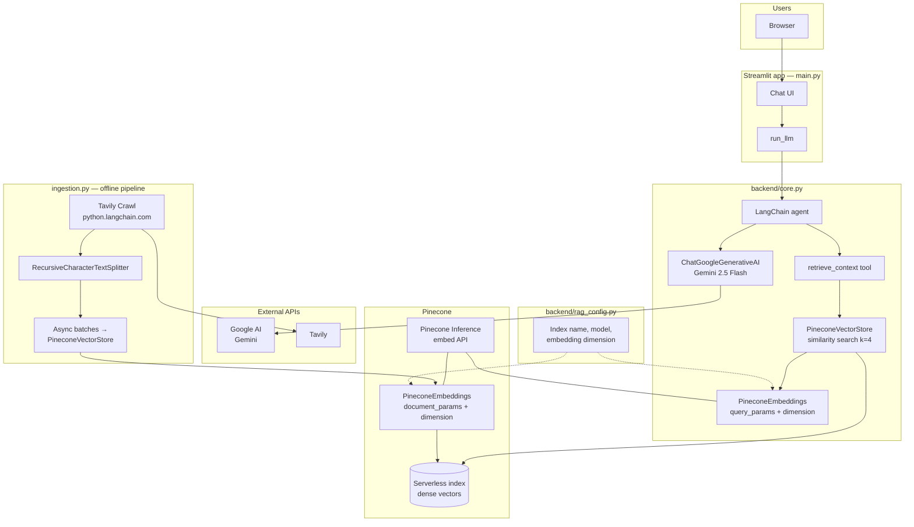
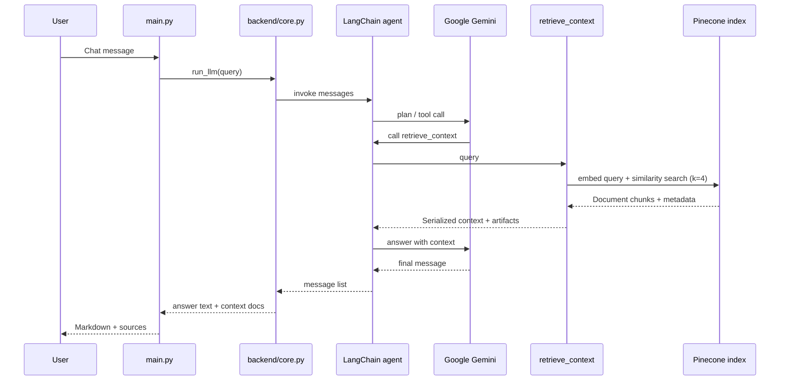

# Documentation Helper

A small **retrieval-augmented generation (RAG)** application that answers questions about **LangChain** using crawled Python documentation, **Pinecone** as the vector store, and **Google Gemini** as the chat model. The chat UI is built with **Streamlit**; ingestion is a separate **async** script that crawls docs and upserts embeddings.

---

## Features

- **Agentic RAG**: LangGraph-style agent (`create_agent`) with a retrieval tool that runs before answering.
- **Hosted embeddings**: Pinecone Inference (`llama-text-embed-v2`) with a configurable **Matryoshka** dimension so vectors match your Pinecone index.
- **Gemini answers**: `ChatGoogleGenerativeAI` (`gemini-2.5-flash`) with citations grounded in retrieved chunks.
- **Clean UI text**: Assistant replies are normalized from Gemini content blocks so internal fields (for example `extras.signature`) are not shown in the chat.

---

## Architecture

### High-level system diagram



### Request flow (one user question)



### Repository layout

| Path | Role |
|------|------|
| `main.py` | Streamlit entrypoint: session state, chat UI, calls `run_llm`. |
| `backend/core.py` | Secrets, embeddings, vector store, Gemini model, agent, `run_llm`. |
| `backend/rag_config.py` | Single source of truth: **index name**, **embedding model**, **dimension** (must match Pinecone index). |
| `ingestion.py` | Crawl LangChain docs (Tavily), chunk, embed, upsert to Pinecone (uses same `rag_config` as the app). |
| `logger.py` | Colored console logging for the ingestion pipeline. |
| `requirements.txt` / `runtime.txt` | Python dependencies and Streamlit Cloud runtime pin. |
| `.streamlit/config.toml` | Streamlit UI configuration. |

---

## Configuration

### Shared RAG settings (`backend/rag_config.py`)

- **`PINECONE_INDEX_NAME`**: Must match the index name in the Pinecone console **exactly** (including spelling).
- **`PINECONE_EMBED_MODEL`**: Default `llama-text-embed-v2`.
- **`PINECONE_EMBED_DIMENSION`**: Must equal the **vector dimension** configured when the index was created (for example `768`).

`make_pinecone_embeddings()` sets both `document_params` and `query_params` so Pinecone Inference receives the Matryoshka **`dimension`** on every embed call (required for correct behavior with some LangChain versions).

### Streamlit Cloud (`backend/core.py`)

Secrets are read from **Streamlit Secrets** and mapped to environment variables:

- `GOOGLE_API_KEY`
- `PINECONE_API_KEY`
- `PINECONE_ENVIRONMENT`
- `PINECONE_REGION`

### Local ingestion (`ingestion.py`)

Uses **`python-dotenv`** and a `.env` file for the same keys where applicable (for example `PINECONE_API_KEY`, `TAVILY_API_KEY`). The Tavily client reads its key from the environment as required by `langchain-tavily`. SSL paths are set to use **certifi** for reliable HTTPS.

---

## Prerequisites

- **Python 3.11** (see `runtime.txt` for Streamlit Cloud).
- Accounts and keys for:
  - [Google AI Studio](https://aistudio.google.com/) (Gemini)
  - [Pinecone](https://www.pinecone.io/)
  - [Tavily](https://tavily.com/) (ingestion crawl)

---

## Setup

### 1. Install dependencies

```bash
cd documentation-helper
python -m venv .venv
.venv\Scripts\activate   # Windows
# source .venv/bin/activate  # macOS / Linux
pip install -r requirements.txt
```

### 2. Pinecone index

Create a **dense** serverless index whose **dimension** equals `PINECONE_EMBED_DIMENSION` in `rag_config.py`. The embedding model and dimension used at **ingest** time must match **query** time (both use `make_pinecone_embeddings()`).

### 3. Run the chat app (local)

Create `.streamlit/secrets.toml` (Streamlit’s format) **or** rely on the same keys if you adapt `core.py` for local `.env` development.

```bash
streamlit run main.py
```

### 4. Ingest documentation (optional / refresh)

```bash
python ingestion.py
```

After ingestion, the same index name and embedding settings power the live Q&A in the Streamlit app.

---

## ASCII overview (plain-text viewers)

```
                    ┌─────────────────────────────────────┐
                    │         ingestion.py (batch)         │
  Tavily Crawl ───► │  chunk → embed (document_params)     │───► Pinecone Index
                    └─────────────────────────────────────┘
                                          ▲
                                          │ same index + embed settings
                                          │ (backend/rag_config.py)
┌──────────┐    ┌─────────────────────────────────────────────────────────┐
│  User    │───►│ main.py → run_llm → Agent + retrieve_context tool       │
└──────────┘    │              │              │                            │
                │              ▼              ▼                            │
                │         Gemini API    Pinecone query embed + search     │
                └─────────────────────────────────────────────────────────┘
```

---

## Troubleshooting

| Symptom | Likely cause |
|--------|----------------|
| `Vector dimension … does not match the dimension of the index` | Index dimension ≠ `PINECONE_EMBED_DIMENSION`, or embeddings not passing `dimension` inside `document_params` / `query_params` (use `make_pinecone_embeddings()`). |
| Empty or irrelevant retrieval | Stale vectors: re-run `ingestion.py` after changing embed model or dimension. |
| Chat shows odd structures / signatures | Should be handled by `_assistant_content_to_text` in `core.py`; ensure you are on the latest `run_llm` implementation. |

---

## Tech stack (summary)

- **UI**: Streamlit  
- **Orchestration**: LangChain `create_agent`, LangGraph execution under the hood  
- **LLM**: `langchain-google-genai` → Gemini  
- **Vector DB**: `langchain-pinecone` → Pinecone serverless index  
- **Embeddings**: Pinecone Inference `llama-text-embed-v2`  
- **Ingestion crawl**: `langchain-tavily` Tavily Crawl  

---

## License

Add your license here if the project is published.
